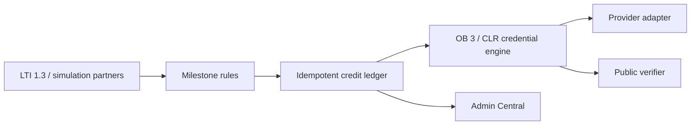

# System blueprint

```mermaid
flowchart LR
  LMS[LTI 1.3 / simulation partners] --> Rules[Milestone rules]
  Rules --> Ledger[Idempotent credit ledger]
  Ledger --> Credentials[OB 3 / CLR credential engine]
  Credentials --> Provider[Provider adapter]
  Credentials --> Verify[Public verifier]
  Ledger --> Admin[Admin Central]
```

All seeded data is synthetic reference architecture data.
